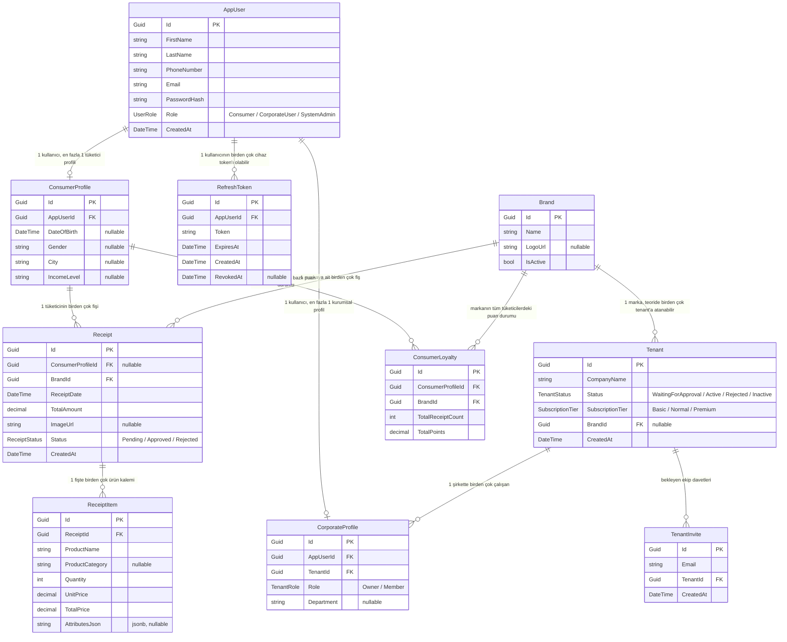

# Veritabanı Şeması (ER Diyagramı)

> Bu dosya `Entities/` + `Data/AppDbContext.cs` (`OnModelCreating`) baz alınarak 14.08.2026'da elle çıkarılmıştır.
> Kod değiştikçe (yeni entity/migration) bu dosya da güncellenmeli — otomatik senkronize olmuyor.

## Foreign key'lerin silme davranışı (`OnDelete`)

Diyagram ilişkinin var olduğunu gösteriyor ama **bir satır silinince ne olacağını** göstermiyor — bu proje için bu kısım kritik, çünkü "veri asla silinmez" altın kuralı burada uygulanıyor. `Data/AppDbContext.cs`'teki `OnModelCreating`'den:

| İlişki | Silme davranışı | Anlamı |
|---|---|---|
| `AppUser` → `ConsumerProfile` | **Cascade** | Kullanıcı silinirse tüketici profili de silinir |
| `AppUser` → `CorporateProfile` | **Cascade** | Kullanıcı silinirse kurumsal profili de silinir |
| `AppUser` → `RefreshToken` | **Cascade** | Kullanıcı silinirse tüm oturum token'ları da silinir |
| `Tenant` → `CorporateProfile` | **Restrict** | İçinde hâlâ çalışanı olan bir Tenant silinemez |
| `Tenant` → `TenantInvite` | **Cascade** | Tenant silinirse bekleyen davetleri de silinir |
| `Brand` → `Tenant` (`Tenant.BrandId`) | **SetNull** | Marka silinirse, ona bağlı tenant'lar silinmez, sadece `BrandId = null` olur |
| `ConsumerProfile` → `Receipt` | **SetNull** | **Altın kural burada:** tüketici hesabını silse bile fişi silinmez, sadece `ConsumerProfileId = null` olur |
| `Brand` → `Receipt` | **Restrict** | İçinde hâlâ fişi olan bir marka silinemez (fiş geçmişi hiç kaybolmasın diye) |
| `Receipt` → `ReceiptItem` | **Cascade** | Fiş silinirse (nadiren olur) içindeki ürün kalemleri de silinir |
| `ConsumerProfile` → `ConsumerLoyalty` | **Cascade** | Tüketici profili silinirse puan kayıtları da silinir |
| `Brand` → `ConsumerLoyalty` | **Cascade** | Marka silinirse o markaya ait puan kayıtları da silinir |

## Notlar / dikkat noktaları

- **`Tenant` ↔ `Brand` ilişkisi 1:N değil, aslında serbest bir eşleştirme:** `Tenant.BrandId` tekil bir FK, `Brand` tarafında geri dönük bir koleksiyon (`ICollection<Tenant>`) tanımlı değil (`WithMany()` boş). Şema seviyesinde birden fazla Tenant aynı Brand'i gösterebilir ama bugün pratikte her tenant'a farklı bir marka atanıyor (bkz. Tenant/Brand ilişkisi tartışması — brand kataloğu tenant'tan bağımsız, admin onayda elle eşleştiriyor).
- **`Receipt.ConsumerProfileId` nullable** — bu, "veri bizim malımız" kuralının teknik implementasyonu.
- **`Brand.IsActive`** 14.08.2026'da eklendi (Marka Yönetimi ekranı için); pasif bir marka silinmiyor, sadece yeni tenant onaylarındaki dropdown'dan düşüyor.
